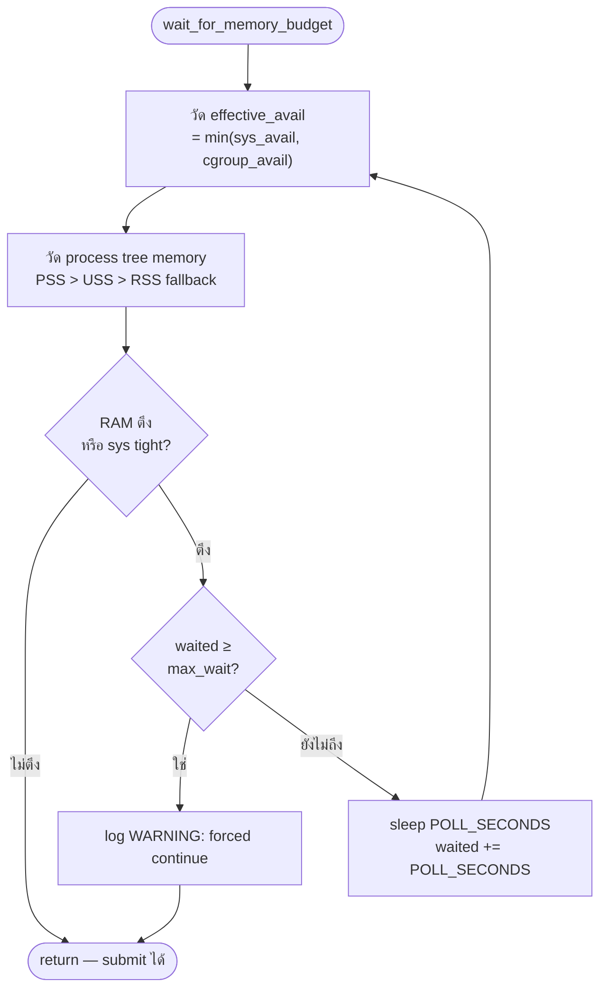

# NDVI Pipeline — Flowchart

## ภาพรวมการทำงาน

```mermaid
flowchart TD
    START([▶ START]) --> CFG

    CFG["📋 Load Config\n─────────────────\nPROVINCE, OUTPUT_DIR\nYEAR_START, YEAR_END\nN_JOBS, MAX_RAM_GB\nband08 / band04 / SAT"]
    CFG --> LOG

    LOG["📝 setup_logging\n─────────────────\nlogs/ndvi_<province>_<ts>.log"]
    LOG --> LOAD

    LOAD["📂 Load Input Data\n─────────────────\ngolden_durian.gpkg → EPSG:4326\nsentinel2_tile.shp"]
    LOAD --> SJOIN

    SJOIN["🗺️ Spatial Join\n─────────────────\npolygons ↔ S2 tile grid\n→ tile list"]
    SJOIN --> TILE_LOOP

    subgraph TILE_LOOP["🔁 Per-Tile Loop"]
        direction TB
        T1["s2_timeseries_fullpath\n─────────────────\nค้นหา scenes B08 + B04 + OMNI\nใน year_start .. year_end"]
        T1 --> T2{มี scenes\nครบ?}
        T2 -- ไม่มี --> T_SKIP([skip tile])
        T2 -- มี --> T3["merge B08 × B04 time series\nget_raster_crs → EPSG\nfilter polygons → to_crs"]
        T3 --> POOL
    end

    subgraph POOL["⚙️ ProcessPoolExecutor  (N_JOBS workers)"]
        direction TB
        P1["seed N_JOBS งานแรก\nwait_for_memory_budget ก่อน submit"]
        P1 --> P2["wait FIRST_COMPLETED\n─────────────────\nรอ future ที่เสร็จก่อน"]
        P2 --> P3["รับ result\n— ถ้า success: total_submitted++\n— ถ้า None: total_skipped++\n— ถ้า error: total_failed++"]
        P3 --> P4["cleanup_memory\nlog MEM stats"]
        P4 --> P5{ยังมี polygon\nรออยู่?}
        P5 -- มี --> P6["wait_for_memory_budget\nsubmit งานใหม่"]
        P6 --> P2
        P5 -- หมดแล้ว --> P_DONE([tile done])
    end

    subgraph WORKER["🔬 process_polygon  (แต่ละ worker)"]
        direction TB
        W1{output\nparquet\nexists?}
        W1 -- ใช่ --> W_SKIP([return path\nskip])
        W1 -- ไม่ใช่ --> W2["create_points_in_polygon\n─────────────────\nmeshgrid 10m ใน bounding box\ncontains_xy → เก็บแต่ใน polygon"]
        W2 --> W3{มี points\nไหม?}
        W3 -- ไม่มี --> W_NONE([return None])
        W3 -- มี --> W4

        subgraph W4["🗓️ วน loop ทุก scene date"]
            direction TB
            S1["gdal.Open\nOMNI SCL + B08 + B04"]
            S1 --> S2["sample_raster_windowed\n─────────────────\nอ่านแค่ bounding box ของ polygon\nไม่โหลด full tile (ประหยัด RAM)"]
            S2 --> S3["OMNI mask\nov == 0 → clear pixels only\n(cloud/shadow ถูกกรองออก)"]
            S3 --> S4["apply_dn_correction\n─────────────────\nถ้า date > 2022-01-25\nลบ 1000 ก่อนคำนวณ\n(ESA baseline 04.00)"]
            S4 --> S5["NDVI = (B08 - B04)\n         ─────────────\n         (B08 + B04)\n→ float32, NaN ถ้า denom=0"]
            S5 --> S6["store vn array\nfor this date column"]
        end

        W4 --> W5["GeoDataFrame\n─────────────────\ncolumns: plot_id, point_id,\nx, y, geometry,\n2019/01/01, 2019/01/15, ..."]
        W5 --> W6["save → parquet\n<province>_segment_ndvi_<tile>_<idx>.parquet"]
        W6 --> W_OK([return path])
    end

    TILE_LOOP --> AGG

    subgraph AGG["📊 aggregate_ndvi"]
        direction TB
        A1["Pass 1 — schema scan\n─────────────────\npq.read_schema ทุกไฟล์\nรวม union ของ month keys\nทั้งหมดข้าม tile"]
        A1 --> A2["สร้าง all_month_cols\n= sorted list of YYYY-MM\nตั้งแต่ year_start ถึง year_end"]
        A2 --> A3

        subgraph A3["🔁 Pass 2 — วน loop ทุก .parquet"]
            direction TB
            B1["gpd.read_parquet\n→ to_crs EPSG:4326\n→ extract lat, lon"]
            B1 --> B2["group scene dates → month\n2019/01/15 → 2019-01"]
            B2 --> B3["คำนวณ per month\n─────────────────\nmean  : mean(skipna)\nmax   : max(skipna)\nmin   : min(skipna)\nmedian: median(skipna)"]
            B3 --> B4["เดือนที่ tile นี้ไม่มีข้อมูล\n→ เติม NaN (schema ตรงกันทุกไฟล์)"]
            B4 --> B5["write_table → 4 ParquetWriters\nsnappy compression"]
        end

        A3 --> A4["close writers"]
    end

    AGG --> OUT

    OUT["📁 Output\n─────────────────\noutput_dir/province/\n├── ndvi_mean.parquet\n├── ndvi_max.parquet\n├── ndvi_min.parquet\n└── ndvi_median.parquet\n\nSchema:\nplot_id | point_id | lat | lon | 2019-01 | 2019-02 | … | 2026-12"]

    OUT --> SUMMARY["📋 Log Summary\nsubmitted / skipped / failed\nelapsed time"]
    SUMMARY --> END_NODE([⏹ END])
```



---

## Memory Guard — ทำงานอย่างไร



---

## Schema ของ Output Files

```
┌──────────┬──────────┬───────┬───────┬─────────┬─────────┬─────┬─────────┐
│ plot_id  │ point_id │  lat  │  lon  │ 2019-01 │ 2019-02 │ ... │ 2026-12 │
│  int64   │  int32   │float32│float32│ float32 │ float32 │     │ float32 │
├──────────┼──────────┼───────┼───────┼─────────┼─────────┼─────┼─────────┤
│   101    │    0     │ 12.34 │101.23 │  0.72   │  NaN   │ ... │  0.81   │  ← 10m point ใน polygon 101
│   101    │    1     │ 12.34 │101.23 │  0.68   │  0.70  │ ... │  0.79   │
│   101    │    2     │ 12.34 │101.23 │  NaN    │  0.65  │ ... │  NaN    │
│   102    │    0     │ 12.35 │101.24 │  0.55   │  0.60  │ ... │  0.58   │  ← polygon อื่น
└──────────┴──────────┴───────┴───────┴─────────┴─────────┴─────┴─────────┘
NaN = ไม่มีข้อมูล (cloud / shadow / ไม่มี scene ในเดือนนั้น)
```
